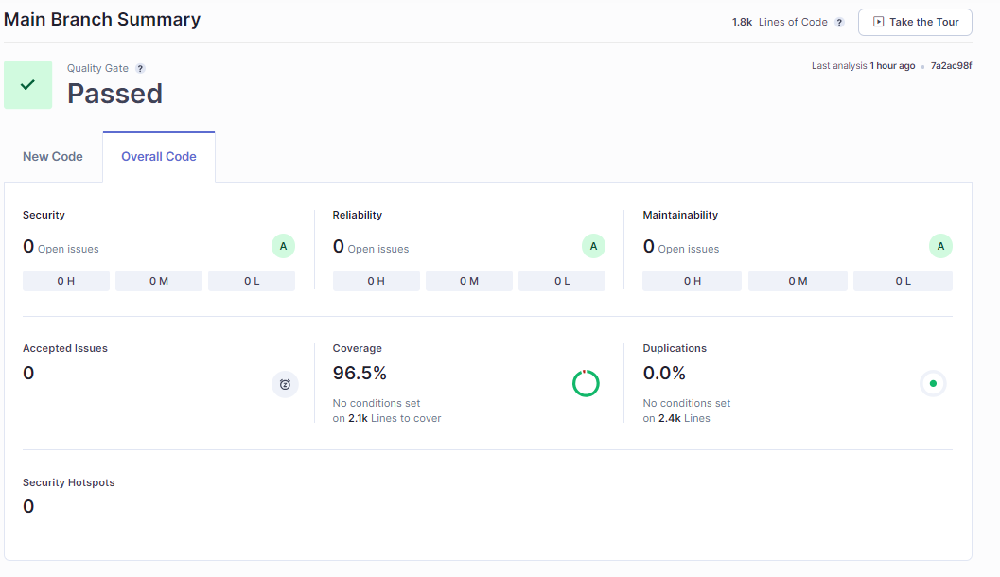

# Micro serviço de pedidos  

Projeto exemplo de um sistema para gestão de pedidos de uma lanchonete utilizando os conceitos de Arquitetura Limpa (Clean Architecture)

## 1) Contexto da aplicação

### Jornada do cliente

O cliente interage com o sistema primeiramente e de forma opcional informando os dados cadastrais NOME, CPF, E-MAIL e TELEFONE. O cliente pode seguir o atendimento sem informar esses dados.

Em seguida ele visualiza uma lista de produtos à venda pela lanchonete e que estão agrupados pelas categorias: LANCHES, BEBIDAS, ACOMPANHAMENTOS e SOBREMESAS.

Após selecionar os produtos desejados, o cliente tem a opção de continuar a compra realizando o pagamento.

O pedido, após confirmado o pagamento, segue para produção e quando estiver pronto o cliente é avisado para retirada do pedido, finalizando assim a jornada do cliente.

### Jornada do estabelecimento

O estabelecimento pode trabalhar com campanhas promocionais utilizando os dados cadastrais informados pelo cliente no processo de compra.

O estabelecimento pode gerenciar as informações dos produtos visualizados pelo cliente, tais como nome, categoria, preço, descrição e imagem, utilizando para isso as funcionalidades de cadastro e edição de categorias e produtos.

O estabelecimento pode gerenciar o pedido à medida que ele segue em preparação, utilizando suas informações ao longo das etapas e atualizando o status do pedido para Aguardando pagamento, Recebido, Em preparação, Pronto, Finalizado e Rejeitado.

## 2) Documentos

### Relatório de testes unitários

[Relatório de cobertura em Html](./static/coverage-report.html)

## 3) Sonarqube

[Análise no SonarCloud](https://sonarcloud.io/summary/overall?id=devair_ms-orders-service)

## 4) Rodar localmente no Docker for Windows

Para executar a aplicação é necesssário ter o Docker instalado localmente com o Kubernetes ativado

### a) Clonar o projeto 

~~~bash
  git clone https://github.com/devair/ms-orders-service.git
~~~

### b) Acessar o diretório do projeto

~~~bash  
  cd ms-orders-service
~~~

### c) Rodar no Docker

### 
~~~bash  
docker compose build && docker compose up
~~~  

### d) Verificar o estado da aplicação
Executar o comando abaixo no prompt e obter o retorno 'Ok' indicando que a aplicação está em execução

~~~bash
curl http://localhost:3333/health
~~~

## 5) Documentação Swagger

http://localhost:3333/api-docs

## 6) Utilização da aplicação

Para utilizar a aplicação precisa-se seguir a sequência de chamadas de APIs abaixo.

### a) Cadastro de Categorias

Utilizar a API abaixo para cadastro de categorias.

POST http://localhost:3333/api/v1/categories

Content-Type: application/json

Body Request:
~~~json
{
    "name": "<CATEGORY NAME>",
    "description": "<CATEGORY DESCRIPTION>"
}
~~~

Response Status Code: 201

Body Response:
~~~json
{
    "id": <CATEGORY ID>,
    "name": "<CATEGORY NAME>",
    "description": "<CATEGORY DESCRIPTION>"
}
~~~

### b) Cadastro de Produtos

Utilizar a API abaixo para cadastro de produtos.

POST http://localhost:3333/api/v1/products

Content-Type: application/json

Body Request:
~~~json
{
    "name": "<PRODUCT NAME>",
    "code": "<PRODUCT CODE>",
    "categoryId": <CATEGORY ID>,
    "image": "<PRODUCT IMAGE>",
    "price": <PRODUCT PRICE>,
    "description": "<PRODUCT DESCRIPTION>"
}
~~~

Response Status Code: 201

Body Response:
~~~json
{
    "name": "<PRODUCT NAME>",
    "code": "<PRODUCT CODE>",    
    "image": "<PRODUCT IMAGE>",
    "price": <PRODUCT PRICE>,
    "description": "<PRODUCT DESCRIPTION>"
    "category": {
        "id": <CATEGORY ID>,
        "name": "<CATEGORY NAME>",
        "description": "<CATEGORY DESCRIPTION>"
    }
}
~~~

### c) Cadastro de Clientes

Opcionalmente um cliente pode ser cadastado, neste caso, utilizar a API abaixo para cadastro de clientes.

POST http://localhost:3333/api/v1/customers

Content-Type: application/json

Body Request:
~~~json
{
    "name": "<CUSTOMER NAME>",
    "email": "<CUSTOMER EMAIL>",
    "phone": "<CUSTOMER MOBILE>",
    "cpf": "<CUSTOMER CPF>"
}
~~~

Response Status Code: 201

Body Response:
~~~json
{
    "id": <CUSTOMER ID>,
    "name": "<CUSTOMER NAME>",
    "email": "<CUSTOMER EMAIL>",
    "phone": "<CUSTOMER MOBILE>",
    "cpf": "<CUSTOMER CPF>"
}
~~~

### d) Inclusão de pedidos

Utilizar a API abaixo para inclusão de pedidos.
O atributo customer é opcional.

POST http://localhost:3333/api/v1/orders

Content-Type: application/json

Body Request:
~~~json
{
    "customer": {
        "cpf": "<CUSTOMER CPF>"
    },
    "orderItems": [
        {
            "product": {
                "code": "<PRODUCT CODE>"
            },
            "quantity": <REQUESTED QUANTITY>,
            "unitPrice": <SOLD PRICE>
        }
    ]
}
~~~

Response Status Code: 201

Body Response:
~~~json
{
    "id": <ORDER ID>,
    "status": "<ORDER STATUS>",
    "amount": <ORDER AMOUNT>
}
~~~

## 7) Vídeos demonstração  

[Vídeo 1 - Explicação geral do projeto](https://vimeo.com/921741552/076d0bb27a)

[Vídeo 2 - Estrutura do projeto no vs code](https://vimeo.com/921763369/d2cd0079d8)

[Vídeo 3 - Uso do Kubernetes e Swagger](https://vimeo.com/921784451/6124eb0a30)

